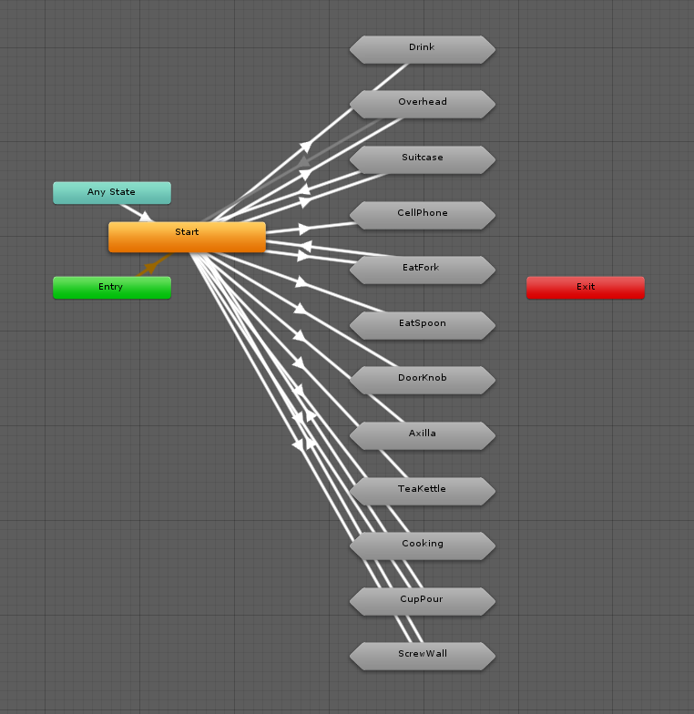
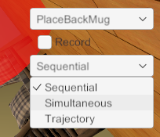
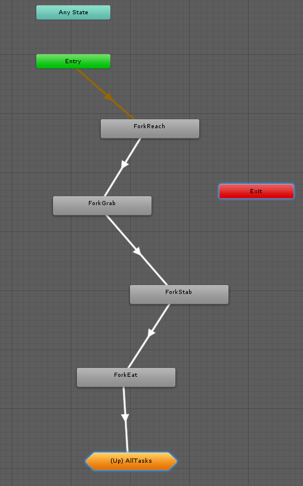

# Experiment Set Up Instructions

The experiment set up is structured using state machines.

Each is accesible using the drop down menu on the right of the screen. This will load the appropriate scene and orresponding objects. A prosthesis control method can be likewise selected.

Each task within the experiment is made up of its own state machine sequence. Below you will see an example of a state machine sequence representing a Fork task. Each state machine within a task can be considered as it's own "mini" task, can be modified to include a difference set of threshold values that will enable the transition to the next state machine.

